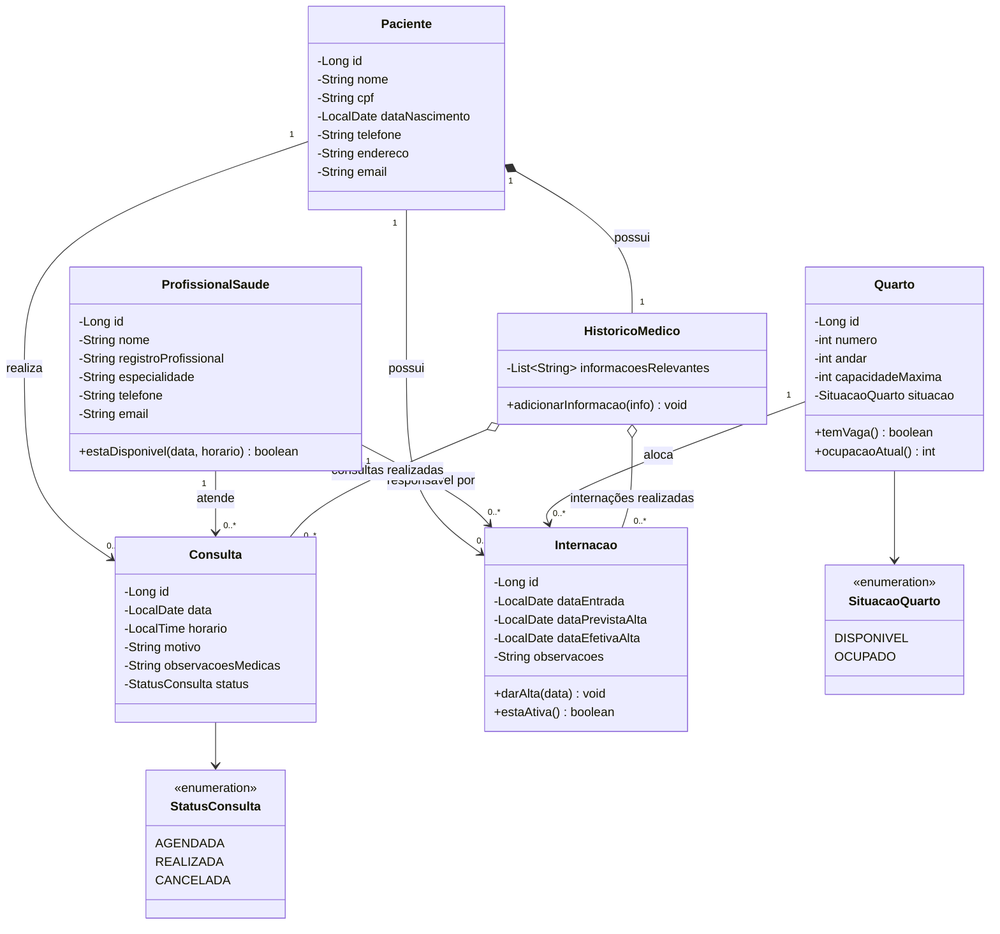

# Diagrama de Classes

Camada Model do Sistema Hospitalar (renderizado automaticamente pelo GitHub).

## Regras de negócio refletidas no modelo

- Consulta exige paciente e profissional responsável (RN2); o profissional não pode ter dois atendimentos no mesmo horário (RN3, validada em `estaDisponivel`).
- Internação exige paciente e quarto disponível (RN4); o quarto não ultrapassa `capacidadeMaxima` (RN5, validada em `temVaga`).
- `HistoricoMedico` consolida consultas e internações do paciente (RN1 e RN6).
